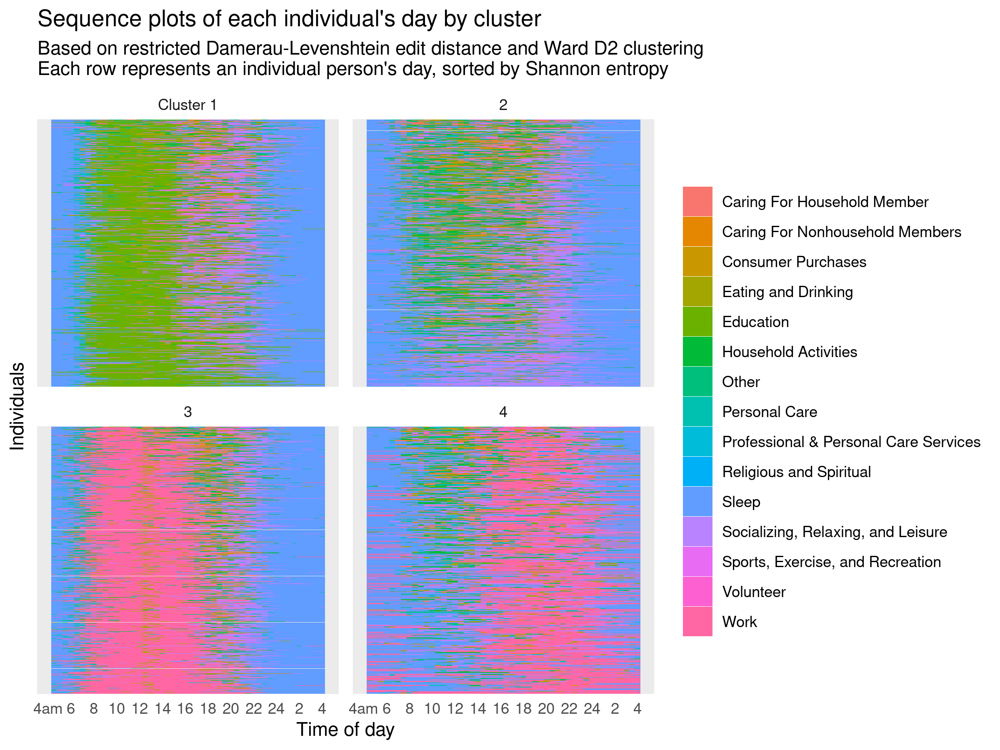
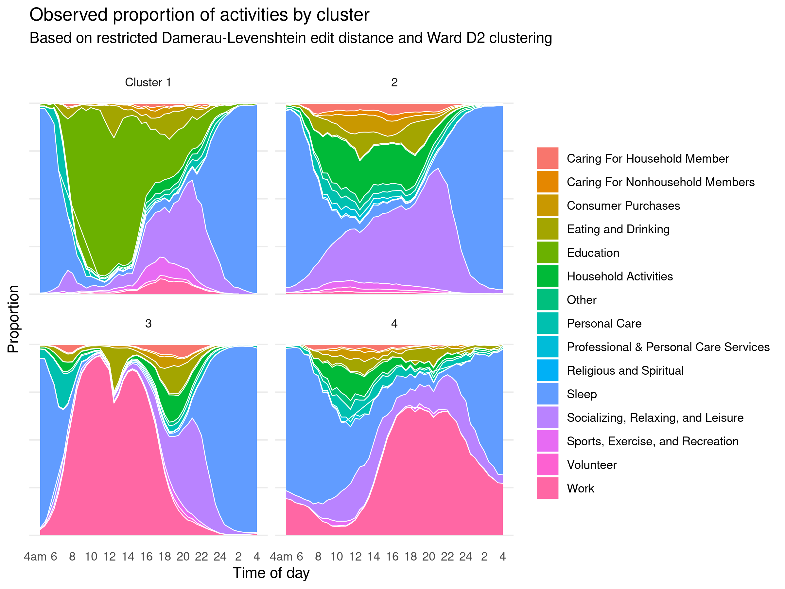
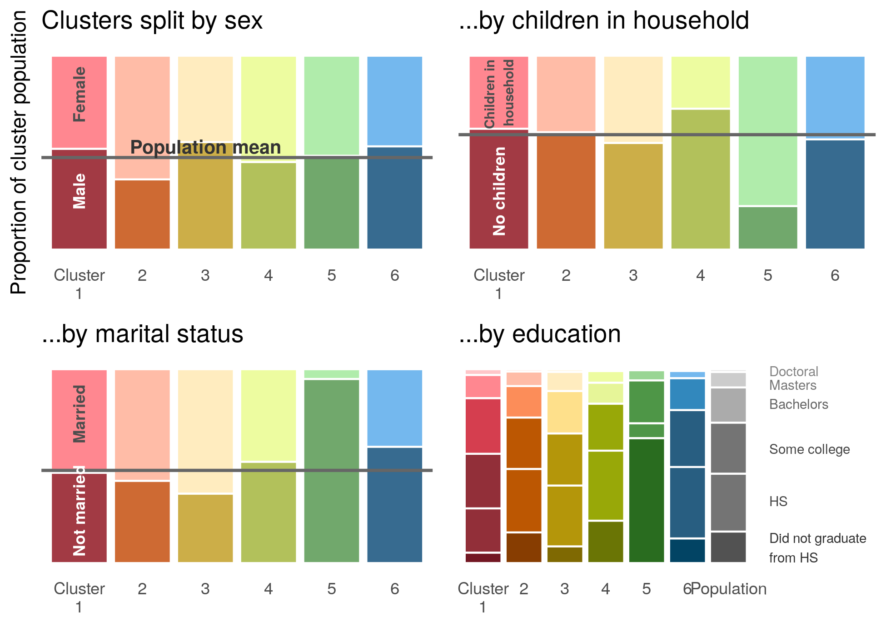

# Sequence analysis of how individuals spend their day

Finding patterns in how individuals spending their day by applying [sequence analysis techniques](https://en.wikipedia.org/wiki/Social_sequence_analysis) à la [Abbot](https://www.jstor.org/stable/2780695) — string-editing techniques, dissimilarity matrices, and hierarchical clustering.

See also: [ATUS repo](https://github.com/joemarlo/ATUS)

 

 

 

 

